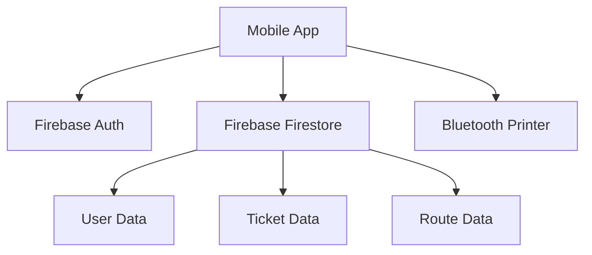

# Bus Ticket Management System Documentation
## Overview
The **Bus Ticket Management System** is a mobile application developed using React Native. It is designed primarily for bus transport companies to efficiently manage ticket sales, generate receipts, and handle customer bookings. A key feature of this system is its integration with Bluetooth thermal printers, enabling the physical printing of tickets for customers.

## Technical Stack
- **Frontend Framework:** React Native with Expo
- **Database:** Firebase Firestore (a NoSQL cloud database)
- **Authentication:** Firebase Auth (for secure user login)
- **Bluetooth Printing:** react-native-ble-plx (for Bluetooth communication)
- **State Management:** React Context API (for managing app state)
- **UI Components:** Native Base & Custom Components (for user interface design)
QR Code Generation: react-native-qrcode-svg (to generate QR codes for tickets)
System Architecture
mermaid

Copy

This architecture diagram illustrates the interaction between the mobile app and various components such as Firebase for authentication and data storage, as well as the Bluetooth printer for ticket printing.

Features
Authentication System
Staff can easily log in and out.
Role-based access control ensures that only authorized personnel can access specific functionalities.
Secure session management protects user information.
Ticket Management
Create new tickets quickly and efficiently.
View ticket history for tracking and auditing purposes.
Generate unique ticket IDs to prevent duplication.
Each ticket includes a QR code for easy scanning and validation.
Receipt Generation
Integration with thermal printers for instant ticket printing.
Bluetooth device discovery to connect to printers seamlessly.
Custom receipt formats to meet company branding and operational needs.
Preview feature allows users to see how the receipt will look before printing.
Route Management
Add or edit routes as necessary to reflect changes in service.
Set pricing for different routes.
Manage schedules to ensure timely departures and arrivals.
Screens Description
1. Login Screen
Provides user authentication through email and password.
Input validation to ensure data integrity.
Error handling to guide users in case of issues.
Secure password management practices to protect user credentials.
2. Dashboard
Displays quick statistics on sales and ticket transactions.
Recent transactions overview for quick reference.
Daily sales summary to track performance.
Quick access buttons for commonly used features.
3. New Ticket Screen
Form for entering customer information (name, contact details).
Dropdown for selecting routes.
Automatic price calculation based on selected route.
Payment status tracking to ensure all transactions are completed.
4. Receipt Preview
gherkin

Copy
+-------------------------+
|      Company Logo       |
|-------------------------|
|   Transaction Details   |
|   Customer Information  |
|   Route Information     |
|   Price Details         |
|-------------------------|
|        QR Code          |
+-------------------------+
This screen allows users to confirm the details of a ticket before printing it.

5. Settings Screen
Configuration options for connecting and managing printers.
User profile management for easy updates to personal information.
System preferences for customizing app behavior.
Database Structure

Copy
firestore/
├── users/
│   └── {userId}/
│       ├── firstName
│       ├── lastName
│       └── role
├── tickets/
│   └── {ticketId}/
│       ├── customerName
│       ├── route
│       └── price
└── routes/
    └── {routeId}/
        ├── from
        ├── to
        └── price
The database structure organizes user data, ticket information, and route details, ensuring easy access and management.

Bluetooth Printing Implementation
Device Discovery: The app can scan for available Bluetooth devices.
Automatic Pairing: Simplifies the connection process between the app and the printer.
Receipt Template Formatting: Customizes the layout of printed receipts.
Error Handling: Manages potential issues during printing.
Security Measures
Firebase Authentication: Ensures secure login and user management.
Data Validation: Prevents invalid data from being stored or processed.
Input Sanitization: Protects against injection attacks.
Secure Storage: Sensitive data is stored securely.
Cost Structure
Development Costs
React Native Development: $3,000 - $5,000
Backend Integration: $1,500 - $2,500
Testing & QA: $1,000 - $1,500
Operating Costs (Monthly)
Firebase Hosting: $25 - $100
Firebase Functions: $40 - $200
Maintenance: $200 - $500
Hardware Requirements
Thermal Printer: $100 - $300/unit
Android Device: $200 - $400/unit
Future Enhancements
Online Booking Integration: Allow customers to book tickets online.
SMS Notification System: Send notifications for bookings and reminders.
Analytics Dashboard: Provide insights into sales and customer behavior.
Multiple Language Support: Make the app accessible to a wider audience.
Installation Guide
bash

Copy
# Clone the repository
git clone [repository-url]

# Install dependencies
npm install

# Setup environment variables
cp .env.example .env

# Run the application
npx expo start
These commands guide users through setting up the application on their local machines.

Troubleshooting
Common issues and solutions:

Bluetooth Connectivity Issues: Ensure the Bluetooth is enabled and the printer is in range.
Printer Pairing Problems: Restart the printer and the app if pairing fails.
Firebase Connection Errors: Check internet connectivity and Firebase configuration settings.
API Documentation
Authentication Endpoints
javascript

Copy
// Login
POST /api/auth/login
{
  "email": "string",
  "password": "string"
}

// Logout
POST /api/auth/logout
Ticket Management
javascript

Copy
// Create Ticket
POST /api/tickets
{
  "customerName": "string",
  "route": "string",
  "price": "number"
}
Support Information
Technical Support: support@example.com
Emergency Contact: +256 xxx xxx xxx
Documentation Updates: Monthly
License
MIT License - See LICENSE file for details.

This documentation provides a comprehensive overview of the Bus Ticket Management System, making it accessible to individuals with limited technical knowledge. Each section explains the components, features, and operational aspects clearly, ensuring that even someone unfamiliar with ICT concepts can grasp the system’s purpose and functionality.